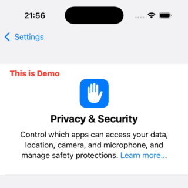

# CustomNavigationTitle

[](https://github.com/apple/swift-package-manager)

CustomNavigationTitleは、スクロールに応じてナビゲーションタイトルをアニメーション付きで表示・非表示にするSwiftUI用のシンプルなパッケージです。この効果はApple純正の設定アプリ、メールアプリ、AppStoreアプリで使われています。



## 特徴
- スクロールに応じてタイトルがフェードイン・アウト
- シンプルなAPIで既存のコードのまま簡単に導入可能
- SwiftUIの`ScrollView`、`List`、`Form`に対応

## 動作環境
-   iOS 15.0+

## インストール
Swift Package Manager (SPM) を使用してインストールできます。

1. Xcode でプロジェクトを開きます。
2. `File` > `Add Package Dependency...` を選択します。
3. `https://github.com/Chronos2500/CustomNavigationTitle.git` を入力します。
4. バージョン指定ルール等を設定し、`Add Package` をクリックします。

## 使い方

### 基本的な使い方
1. `ScrollView`、`List`、`Form`のいずれかに`.scrollAwareTitle("CustomTitle")`修飾子を追加します。
2. 次にタイトルの表示・非表示をトリガーするViewに`titleVisibilityAnchor()`修飾子を追加します。このViewが可視領域から外れるとタイトルが表示されます。
* ViewがNavigationStack等でラップされていれば、これだけで機能します。
* `.navigationTitle()`より`.scrollAwareTitle("CustomTitle")`が優先されますが、Navigation History Stack機能のために`.navigationTitle()`も設定することを推奨します。
* 詳細なサンプルは[Examplesフォルダのプロジェクト](Exaples)にあります。

```swift
import SwiftUI
import CustomNavigationTitle

struct ContentView: View {
    var body: some View {
        NavigationStack {
            ScrollView {
                Text("First")
                    .font(.largeTitle)
                    .padding()
                Text("Second")
                    .font(.largeTitle)
                    .padding()
                    .titleVisibilityAnchor()
                Text("Third")
                    .font(.largeTitle)
                    .padding()
            }
            .scrollAwareTitle("CustomTitle")
        }
    }
}
```

### カスタムタイトルビューを使用
```swift
.scrollAwareTitle {
    HStack {
        Image(systemName: "star.fill")
        Text("お気に入り")
    }
}
```

## ライセンス
MIT ライセンスのもとで提供されます。

Chronos2500 © 2025
